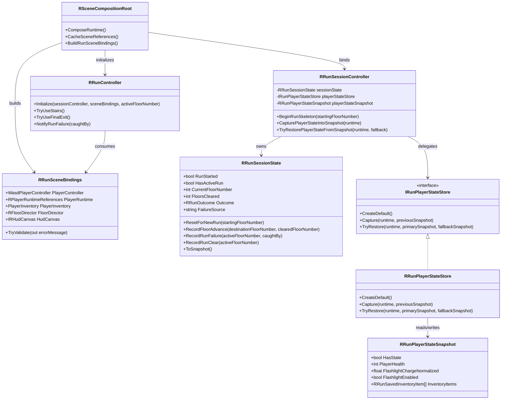

# Run Runtime Structure Refactor

This document captures the next safe split for the live run runtime without
rewriting authored scene placement.

## Target Structure



## Why This Split

- `RRunSessionController` keeps orchestration and event publication only.
- `RRunSessionState` becomes the serialized run truth for progress and outcome.
- `IRunPlayerStateStore` owns capture and restore of player runtime data.
- `RRunSceneBindings` becomes the authored scene contract passed into
  `RRunController` instead of a long constructor-style parameter list.

## Added Skeleton Files

- [IRunPlayerStateStore.cs](../../Assets/Scripts/Rebuild/Runtime/IRunPlayerStateStore.cs)
- [RRunPlayerStateSnapshot.cs](../../Assets/Scripts/Rebuild/Runtime/RRunPlayerStateSnapshot.cs)
- [RRunPlayerStateStore.cs](../../Assets/Scripts/Rebuild/Runtime/RRunPlayerStateStore.cs)
- [RRunSessionState.cs](../../Assets/Scripts/Rebuild/Runtime/RRunSessionState.cs)
- [RRunSceneBindings.cs](../../Assets/Scripts/Rebuild/Runtime/RRunSceneBindings.cs)
- [RRunController.Bindings.cs](../../Assets/Scripts/Rebuild/Runtime/RRunController.Bindings.cs)
- [RRunSessionController.RefactorSkeleton.cs](../../Assets/Scripts/Rebuild/Runtime/RRunSessionController.RefactorSkeleton.cs)

## Created Asset Seeds

- [RRunRoutingSettings.asset](../../Assets/Resources/MainEscape/Run/RRunRoutingSettings.asset)
- [RRunProgressionRules.asset](../../Assets/Resources/MainEscape/Run/RRunProgressionRules.asset)
- [RRunPlayerDefaults.asset](../../Assets/Resources/MainEscape/Run/RRunPlayerDefaults.asset)

## Authored Scene Ownership

- [RMainEscape_Lobby.unity](../../Assets/Scenes/RMainEscape_Lobby.unity) now owns the
  `RRunSessionController` asset wiring for `RRunRoutingSettings` and
  `RRunPlayerDefaults`.
- [RMainScene_5F.unity](../../Assets/Scenes/RMainScene_5F.unity),
  [RMainScene_4F.unity](../../Assets/Scenes/RMainScene_4F.unity),
  [RMainScene_3F.unity](../../Assets/Scenes/RMainScene_3F.unity),
  [RMainScene_2F.unity](../../Assets/Scenes/RMainScene_2F.unity), and
  [RMainScene_1F.unity](../../Assets/Scenes/RMainScene_1F.unity)
  now own the `RRunController` asset wiring for `RRunProgressionRules`.
- There is still no prefab owner for these controllers, so future tuning should
  treat this as a coordinated scene-level authored contract.

## Authoring Helpers

- [RRunSessionController.cs](../../Assets/Scripts/Rebuild/Runtime/RRunSessionController.cs)
  now exposes `Use Canonical Run Assets` via `ContextMenu`, and fills missing
  canonical assets during `Reset` and `OnValidate`.
- [RRunController.cs](../../Assets/Scripts/Rebuild/Runtime/RRunController.cs)
  now fills missing `RRunProgressionRules` during `Reset` and `OnValidate`, and
  exposes `Assign Canonical Progression Rules` via `ContextMenu`.
- The earlier batch editor helper for canonical run asset rewiring was removed
  after scene-level `Reset`, `OnValidate`, and `ContextMenu` flows on
  `RRunSessionController` and `RRunController` became the maintained path.

## ScriptableObject Candidates

### 1. Routing Data

```csharp
[CreateAssetMenu(fileName = "RRunRoutingSettings", menuName = "Main Escape/Run Routing Settings")]
public sealed class RRunRoutingSettings : ScriptableObject
{
    [SerializeField] private string lobbyScenePath = "Assets/Scenes/RMainEscape_Lobby.unity";
    [SerializeField] private string tutorialScenePath = "Assets/Scenes/RMainEscape_tuto.unity";
    [SerializeField] private string elevatorTransitionScenePath = "Assets/Scenes/RMainEscape_ElevatorTransition.unity";
    [SerializeField, Min(1)] private int startingFloorNumber = 5;
    [SerializeField] private RFloorSceneEntry[] floorScenes;

    public string LobbyScenePath => lobbyScenePath;
    public string TutorialScenePath => tutorialScenePath;
    public string ElevatorTransitionScenePath => elevatorTransitionScenePath;
    public int StartingFloorNumber => startingFloorNumber;
    public RFloorSceneEntry[] FloorScenes => floorScenes;
}
```

### 2. Run Progression Rules

```csharp
[CreateAssetMenu(fileName = "RRunProgressionRules", menuName = "Main Escape/Run Progression Rules")]
public sealed class RRunProgressionRules : ScriptableObject
{
    [SerializeField] private bool directExitRequiresKeyOnAuthoredFloors = true;
    [SerializeField] private string startupStatusMessage = "Wake up on 5F and reach the street.";
    [SerializeField] private string missingKeyStatusMessage = "Find the Iron Gate Key.";
    [SerializeField] private string unlockedGateStatusMessage = "Use the emergency stairs.";
    [SerializeField] private string finalFloorStatusMessage = "Head for the street exit.";

    public bool DirectExitRequiresKeyOnAuthoredFloors => directExitRequiresKeyOnAuthoredFloors;
    public string StartupStatusMessage => startupStatusMessage;
    public string MissingKeyStatusMessage => missingKeyStatusMessage;
    public string UnlockedGateStatusMessage => unlockedGateStatusMessage;
    public string FinalFloorStatusMessage => finalFloorStatusMessage;
}
```

### 3. Player Defaults

```csharp
[CreateAssetMenu(fileName = "RRunPlayerDefaults", menuName = "Main Escape/Run Player Defaults")]
public sealed class RRunPlayerDefaults : ScriptableObject
{
    [SerializeField, Min(1)] private int defaultHealth = 3;
    [SerializeField, Range(0f, 1f)] private float defaultFlashlightChargeNormalized = 1f;
    [SerializeField] private bool flashlightEnabledByDefault = true;
    [SerializeField] private PlayerInventory.ItemStack[] startingItems;

    public int DefaultHealth => defaultHealth;
    public float DefaultFlashlightChargeNormalized => defaultFlashlightChargeNormalized;
    public bool FlashlightEnabledByDefault => flashlightEnabledByDefault;
    public PlayerInventory.ItemStack[] StartingItems => startingItems;
}
```

## Fail-Fast Fix

The project already has
[MainEscapeRuntimeSettings.asset](../../Assets/Resources/MainEscape/MainEscapeRuntimeSettings.asset),
so the settings loader can stop hiding missing-resource errors.

```csharp
public static MainEscapeRuntimeSettings Load()
{
    MainEscapeRuntimeSettings loadedSettings = Resources.Load<MainEscapeRuntimeSettings>(ResourcePath);

    if (loadedSettings == null)
    {
        throw new InvalidOperationException(
            $"Missing '{nameof(MainEscapeRuntimeSettings)}' resource at 'Resources/{ResourcePath}.asset'. " +
            "Fix the asset path or restore the missing asset before continuing.");
    }

    cachedSettings = loadedSettings;
    return loadedSettings;
}
```

This is the right immediate fix because it surfaces the authored asset problem
at the first callsite instead of letting runtime boot with fake defaults.
