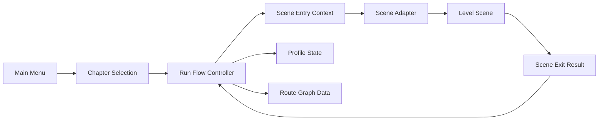

# Scene Contract And Data Separation Plan

Date: 2026-04-25

Status: design gate before implementation. Do not rename scripts, scenes,
prefabs, folders, or serialized fields from this document alone.

## Goal

Prepare the project for hospital, backrooms, pool, and future chapter content
without forcing every scene into the same hierarchy.

The priority order is:

1. Remove scene-to-scene coupling.
2. Keep scenes independently playable.
3. Define only minimal shared contracts.
4. Keep scene internals flexible.
5. Move expansion rules into data before broad renaming.

## Canonical Vocabulary

Use this vocabulary in new docs, data assets, UI copy for tools, and new code.
Existing `R*`, `IR*`, `MainEscape*`, and `Prototype*` names stay in place until
the contract/data split is working.

| Canonical term | Meaning | Current legacy examples |
|---|---|---|
| `Game Mode` | A top-level playable mode. The current one is `MainEscape`. | `MainEscape`, `RRun*` |
| `Chapter` | A selectable content group from the main menu. | Hospital loop, future Backrooms |
| `Route Graph` | Data describing possible movement between scene nodes. Supports linear, branching, random, and loop routes. | `RRunRoutingSettings`, `floorScenes` |
| `Scene Node` | A logical stop in a route graph. It points to one Unity scene and owns entry/exit metadata. | `5F`, `4F`, `RMainScene_5F` |
| `Level Scene` | A playable scene node that contains gameplay. | `RMainScene_5F~1F` |
| `Support Scene` | A temporary or utility scene that is not itself route progress. | tutorial, elevator transition |
| `Run State` | Per-run mutable state: current node, elapsed time, health, inventory, temporary flags. | `RRunSessionController` snapshot |
| `Profile State` | Permanent state: achievements, unlocked chapters, collected notes, lore journal memory. | future persistent save |
| `Scene Entry` | The minimal input passed into a scene when it starts. | composition root initialization |
| `Scene Exit` | The minimal result a scene returns when it finishes or requests navigation. | floor clear/failure/final clear |
| `Scene Adapter` | A component that maps a concrete scene's local structure into the shared contract. | `RSceneCompositionRoot` |
| `UI Port` | A minimal interface for HUD/modal/prompt/note UI binding. | `IRHudCanvas`, HUD binders |

## Decisions Locked By User

- Continuous play remains the main target.
- The main menu must be able to start a selected chapter directly.
- Route graphs must allow future branching, random selection, and loops.
- Persistent profile state must include achievements and collectibles.
- Standalone scene testing may use test defaults.
- Rename work happens after contract and data separation, not before.

## Target Runtime Shape

The scene adapter can be implemented differently per scene. Hospital can keep
`RSceneCompositionRoot`; a backrooms scene can use a different component. The
shared requirement is only that it can accept entry data and report exit data.

## Minimal Scene Contract

### Scene Entry

Required fields:

| Field | Purpose |
|---|---|
| `gameModeId` | Usually `main_escape` for the current mode. |
| `chapterId` | Example: `hospital`, `backrooms`. |
| `routeGraphId` | The route graph being played. |
| `sceneNodeId` | The logical node to load, not the scene name. |
| `runId` | Current run identifier. |
| `runSeed` | Seed for random placement and route decisions. |
| `playerState` | Health, inventory, flashlight, temporary run facts. |
| `spawnRequest` | Spawn id or fallback spawn policy. |
| `testDefaultsAllowed` | Enables standalone scene defaults when no run exists. |

Optional fields:

| Field | Purpose |
|---|---|
| `difficultyProfileId` | Allows chapter-specific balancing. |
| `entryReason` | Start chapter, retry, continue, transition, debug test. |
| `sceneFlags` | Tutorial, finale, chase-intense, no-randomization, etc. |

### Scene Exit

Required fields:

| Field | Purpose |
|---|---|
| `outcome` | Continue, cleared, failed, returnedToMenu, abandoned. |
| `exitId` | The local exit used, such as `stairs_down`, `elevator`, `pool_door`. |
| `playerState` | Updated per-run player state. |
| `profileEvents` | Permanent events such as note collected, achievement unlocked. |

Optional fields:

| Field | Purpose |
|---|---|
| `requestedRouteAction` | Continue route, pick random branch, loop, jump to node, return to menu. |
| `failureReason` | Enemy, trap, timeout, scripted event. |
| `debugSummary` | Useful for standalone testing and smoke reports. |

## Player Handling

Allowed:

- A scene may spawn the player from a prefab using `spawnRequest`.
- A scene may use an authored player and register it through the adapter.
- A standalone scene may create a test player using test defaults.

Disallowed:

- A gameplay system should not resolve the official player through global
  `FindFirstObjectByType` when an entry context exists.
- A scene should not require the lobby scene to have run before the player can
  be initialized.

## UI Binding

UI structure remains scene-local and flexible.

Minimum UI ports:

| UI Port | Responsibility |
|---|---|
| `HudPort` | Health, stamina, inventory, quick slots, threat state. |
| `PromptPort` | Interact prompt and context action text. |
| `ModalPort` | Clear, failure, pause, confirmation surfaces. |
| `CollectiblePort` | Note pickup, note pouch, permanent memory feedback. |

Scenes may implement all ports on one canvas or split them across multiple UI
objects. The contract should not require a fixed hierarchy.

## Data Assets To Introduce

| Asset | Purpose | Replaces or absorbs |
|---|---|---|
| `ChapterDefinition` | Main menu selectable chapter, display name, start graph, unlock state. | hardcoded lobby start assumptions |
| `RouteGraphDefinition` | Nodes and edges, including branch/random/loop policy. | `floorScenes`, next-lower-floor logic |
| `SceneNodeDefinition` | Scene path, node id, tags, test defaults, support/level classification. | scene-name parsing |
| `LevelDefinition` | Chapter-local tuning: enemy set, item table, note table, ambience profile. | `MainEscapeFloorCatalog` static data |
| `PersistentProfileDefinition` | Save schema version and profile-level unlock/collection categories. | future achievements/collectibles |
| `SceneTestDefaults` | Default player state and spawn for direct Play testing. | implicit fallback run creation |

## Existing Hospital Adapter Strategy

Do not rewrite the hospital scenes first.

Use existing systems as adapters:

| Existing system | Future role |
|---|---|
| `RSceneCompositionRoot` | Hospital `Scene Adapter` |
| `RRunSessionController` | Temporary bridge for `Run State`; later split into run flow + state store |
| `RRunRoutingSettings` | Seed for `RouteGraphDefinition` |
| `MainEscapeFloorCatalog` | Seed for `LevelDefinition` assets |
| `IRHudCanvas` and binders | Hospital implementation of UI ports |

### Implementation Checkpoint

Current hospital routing now has a graph-first read path before the legacy
floor-number fallback:

- `SceneContractData` defines the loose route, entry, exit, and profile data
  contracts.
- `HospitalRouteGraphAdapter` converts the existing authored floor route list
  into a temporary `Route Graph` snapshot.
- `SceneRouteGraphResolver` resolves fixed, choice, weighted random, loop, and
  conditional edges without checking scene names.
- `RRunSceneRouteFloorResolver` converts that graph decision back to the
  existing floor-number handoff so lobby, elevator transition, and authored
  floor loading stay unchanged.
- `HospitalChapter.asset` and `HospitalRouteGraph.asset` now provide the first
  real ScriptableObject chapter/route graph data path. `RRunRoutingSettings`
  references the chapter asset, and the run session reads that data before
  falling back to legacy floor route arrays.
- `ChapterDefinition`, `RouteGraphDefinition`, `SceneTestDefaults`, and
  `PersistentProfileDefinition` live in class-name-matched script files so
  Unity can import their ScriptableObject assets safely.
- `RRunSessionController.SelectChapter` and `StartChapterAndLoadGameplay`
  establish the first chapter-start API. The existing lobby start path remains
  compatible and falls back to `RRunRoutingSettings.DefaultChapter`.
- `RouteGraphFloorRouteAdapter` is the temporary hospital bridge from
  `RouteGraphDefinition` nodes/edges back to floor-number routing. It should be
  retired once scene entry/exit contracts own routing end to end.
- Scene-load floor identity also tries the route graph node paths before the
  legacy scene-route resolver, reducing reliance on canonical scene names.
- `RSceneRouteMembershipUtility` centralizes the temporary route-membership
  bridge so discovery UI, authoring marker visuals, prototype flashlight
  gating, and direct-exit eligibility can accept route-driven scenes before
  falling back to authored scene-name checks.
- Floor residency checks now read the route graph path first before checking
  canonical floor scene names, so future non-`RMainScene_*` hospital or chapter
  scenes can still use scene-resident authoring.
- The scene-resident authored floor builder now uses the same residency policy,
  avoiding a split where policy accepts a route-driven scene but floor build
  still rejects it by canonical scene name.
- Vent graph fallback suppression and floor ambience now resolve route-driven
  floor scenes before falling back to canonical scene names.
- Runtime pickup visibility/scaling gates and audio startup tracing now use
  route membership instead of direct authored scene-name checks.
- Central route membership now checks runtime-settings route data before legacy
  authored scene-name fallback when no run session exists; canonical floor names
  no longer reauthorize route misses while route data is present.
- Door and pickup discovery controllers retry a previously false route
  membership result at a short interval during play, so scene-local systems can
  recover when the run session appears after the component's first evaluation.
- Authored floor warning conditions now resolve the current scene's route floor
  before falling back to the legacy canonical start-floor check.
- When a run session or explicit configured route exists, it is treated as more
  authoritative than runtime-settings fallback routes or canonical scene names;
  legacy direct-play fallback is only for scenes without active route state.
- Floor ambience and authored-floor warning checks also fail closed on route
  miss when a run session exists, preventing canonical floor names from
  re-enabling systems for scenes outside the active route.
- `RRunSessionController.ResolveNextFloorNumber` tries the graph-first path and
  falls back to the old lower-floor resolver when graph data cannot resolve.
- Route graph validation now rejects duplicate scene paths and includes a
  hospital-chain validator for the authored 5F to 1F descent route.
- Sessionless route membership and floor residency now try
  `RRunRoutingSettings.DefaultChapter` route graph data before runtime-settings
  fallback routes, and route misses fail closed while graph data is available.
- Lobby button binding now avoids double-binding runtime listeners when the
  scene already has persistent button callbacks.
- Enemy noise consumers now use `INoiseEventBus` as the small contract and
  resolve only explicit or same-scene `NoiseSystem` instances, removing the old
  singleton fallback from normal noise-bus resolution.
- Spatial enemy/room audio now supports explicit player references and uses a
  scene-local fallback resolver instead of global player lookup.
- `RSceneReferenceLookup` is the current low-level fallback rule for scene
  references: keep serialized references first, then same-scene lookup, then
  only explicit legacy fallback where the old authored loop still requires it.
- Door discovery visibility now supports explicit player/fog binding and uses
  same-scene fallback lookup, keeping authored references preferred while
  avoiding broad player scans.
- Scene-resident authored floor building can now receive an explicit target
  scene or `MainEscapeFloorAuthoring`, reducing accidental dependence on the
  active scene during transitions or additive scene work.
- Runtime noise producers (`NoiseEmitter`, throwable bottle shatter, medical
  cabinet shatter, loud floor panels, and self-contained doors) now emit through
  `INoiseEventBus` using explicit injection or same-scene lookup, reducing
  static noise-system coupling outside tutorial/demo code.
- `INoiseEventBus` is still a transitional bridge; new producers and consumers
  should accept an injected/configured bus before resolving `NoiseSystem`.
- Enemy vision visualization and loud-floor reflection now use explicit player
  binding or same-scene player lookup instead of broad player searches.
- Low-risk tutorial bootstrap lookups now use scene-scoped reference lookup for
  the authoring root, main camera, and door-blocking enemy checks.
- The demo door loop and tutorial door noise now emit through `INoiseEventBus`
  and use scene-local actor lookup, leaving only explicit legacy fallback paths.
- Runtime ambience now has an explicit scene API and caches the scene received
  from load events, reducing repeated active-scene queries in audio balancing.
- `AudioScenePlayerReferenceResolver` is a temporary scene-local player
  fallback for spatial audio and loud-floor reactions; long term, scene entry
  or player ports should provide the player explicitly.
- Run-session player-state restore and scene-composition wait checks now use
  scene-local reference lookup, so additive or test scenes do not satisfy
  gameplay readiness with objects from another loaded scene.
- Fog-reactive enemy visibility now refreshes point-light caches per owning
  scene, preventing lights in another loaded scene from influencing local
  detection and render visibility.
- Final-exit touch triggers now keep authored `RRunController` references
  preferred and use same-scene fallback lookup when the reference is missing.
- Floor directors, shadow startle markers, floor item cleanup, floor trap
  cleanup, and legacy floor-authoring marker lookups now use scene-local
  queries instead of global `FindObjectsByType` followed by scene filtering.
- Tutorial HUD/light/overlay/audio-listener fallback, game-clear panel session
  resolution, player prototype camera checks, and runtime shadow-caster repair
  now resolve through the owning scene or loaded managed scenes instead of
  assuming the active scene owns the runtime objects.
- Ground and vent enemy runtime factories now accept a scene-selected
  `MainEscapeRuntimePrefabCatalog` from the floor or tutorial owner, leaving
  scene-less callers on the explicit default catalog instead of active-scene
  catalog discovery.
- Peripheral run-session consumers such as player-caught retry, floor build
  randomization, and tutorial elevator exit now try same-scene
  `RRunSessionController` before using the cached persistent session bridge in
  `RRunSessionResolver`.
- Fog point-light refresh now uses scene-root lookup when an owning scene is
  available, and floor ambience resolution also checks the target scene for a
  run session before falling back to the persistent singleton.
- `RRunController` and elevator transition now keep explicit/session-local
  resolution first and reach the persistent session only through
  `RRunSessionResolver`.
- Legacy floor bootstrap actor positioning and authored-floor current-scene
  checks now use loaded-scene and scene-local lookups instead of older active
  scene/global paths.
- UI session fallback paths no longer repeat a second global
  `FindFirstObjectByType<RRunSessionController>` after using the centralized
  `RRunSessionResolver` bridge.
- Runtime item icon resolution now accepts an owning scene and HUD/tutorial
  callers pass their scene so catalog overrides can be resolved without relying
  on the active-scene catalog path.
- Lobby UI session resolution now follows the same explicit reference,
  same-scene session, cached-session fallback order as gameplay modal UI.
- Enemy runtime factory catalog fallback now uses parent/layout scene context
  when available and only drops to the explicit default catalog when no scene
  owner is supplied.
- Scene-less enemy factory, vent enemy, and item icon fallback paths now load
  the default runtime prefab catalog explicitly instead of silently consulting
  the active scene; scene override selection remains available through injected
  catalogs or `LoadForScene(...)`.
- Generated floor build sources now pass the runtime parent scene into the
  bootstrap path, keeping authored-floor discovery tied to the owning scene
  while preserving the old active-scene wrapper for legacy or parentless calls.
- Lobby modal authoring tooling now resolves the controller in the active editor
  scene through the same scene-local lookup helper instead of scanning every
  loaded object.
- Audio startup ambience now scans loaded managed scenes and caches the scene it
  applies, leaving the explicit active-scene wrapper only as a compatibility API.
- Runtime 2D shadow-caster repair now iterates loaded scenes at startup and
  repairs each scene locally, rather than assuming the active scene is the only
  scene that needs post-load mesh recovery.
- Fog-reactive local-light caching now returns an empty cache when no owning
  scene is available instead of falling back to a global light scan.
- Low-risk run-session consumers now resolve assigned/session-local/cached
  session fallback through `RRunSessionResolver`. Active-session route
  membership, floor residency, composition bootstrap, and elevator transition
  also use that resolver; the cached fallback is confined to that resolver, and
  the session accessor no longer performs global object search.
- Noise event bus resolution now stops at explicit or scene-local
  `NoiseSystem` lookup, and tutorial noise bootstrap creates or uses a
  tutorial-scene-local `NoiseSystem` instead of consulting `NoiseSystem.Instance`.
- Runtime noise producers and listeners now pass their owning scene to the noise
  bus resolver; tutorial bootstrap creates a tutorial-scene-local `NoiseSystem`
  instead of reusing a singleton from another loaded scene.
- Legacy floor-bootstrap overloads now resolve a loaded matching floor scene
  instead of consulting the active scene, keeping authored-floor discovery
  stable under additive or editor test setups.
- `MainEscapeRuntimePrefabCatalog.Load()` now resolves the default catalog
  instead of inspecting the active scene; scene-specific prefab overrides must
  use `LoadForScene(...)`.
- The legacy `TryApplySceneAmbienceForActiveScene` compatibility wrapper now
  applies ambience through loaded managed-scene discovery instead of reading the
  active scene directly.
- `RRunSessionController` startup now processes loaded scenes through the normal
  scene-loaded handler instead of assuming the active scene is the only relevant
  scene.
- Player-caught fallback reload now targets the player's owning scene through
  `SceneLoadUtility.ReloadScene(...)`, and run retry reloads use the session's
  current floor scene path instead of an active-scene reload wrapper.
- EditMode boundary tests now pin the remaining intentional legacy bridges so
  new scene coupling, singleton fallback, or broad global lookup usage does not
  creep back in during future map or naming work.

This is intentionally still an adapter bridge, not the final chapter system.
The next safe step is validating the hospital route graph asset against Build
Settings and then moving main menu chapter start to read `ChapterDefinition`
data directly.

## Route Graph Rules

A route graph must not assume floor numbers are descending.

Supported edge policies:

| Policy | Example |
|---|---|
| `Fixed` | Hospital 5F to 4F. |
| `Choice` | Player chooses left/right route. |
| `WeightedRandom` | Backrooms node picks one of several valid exits. |
| `Loop` | Node can return to an earlier node intentionally. |
| `Conditional` | Requires key item, note, achievement, or run flag. |

Scene code should emit `exitId`; route graph data decides the next node.

## Persistent Profile State

Profile state is outside the run.

Minimum profile categories:

| Category | Examples |
|---|---|
| `CollectedNotes` | Note ids acquired once and remembered permanently. |
| `Achievements` | Chapter clear, special escape, no damage, all notes. |
| `ChapterUnlocks` | Unlock backrooms/pool/additional chapters. |
| `SeenTutorials` | Avoid repeating tutorial prompts. |
| `Settings` | Volume, accessibility, display options. |

Run state may reference profile facts, but a scene should not write directly to
storage. It should emit `profileEvents`, then the run flow applies them.

## Standalone Test Defaults

Standalone scenes are allowed to boot without the main menu or previous route
state.

Rules:

- Test defaults must be explicit data, not hidden code fallback.
- Test defaults must be clearly marked as non-shipping route state.
- Test defaults can define player inventory, health, spawn id, run seed, and
  unlocked profile facts needed for local testing.
- Validation should report when a scene only works because test defaults were
  used.

## Rename Policy

Rename after contract/data separation.

Order:

1. Add canonical vocabulary to docs and new assets.
2. Add data contracts without renaming existing scene/scripts.
3. Adapt hospital scenes through existing components.
4. Validate continuous play and chapter-start play.
5. Rename low-risk non-MonoBehaviour utilities first.
6. Rename MonoBehaviours, prefabs, scenes, and Resources paths only with a
   reference migration plan.

High-risk names to defer:

| Current | Reason to defer |
|---|---|
| `RMainScene_*` | Build Settings, tests, docs, serialized route paths. |
| `RRunSessionController` | Singleton and scene-persistent state owner. |
| `IRHudCanvas` | Scene/prefab MonoBehaviour reference risk. |
| `PrototypeAudioManager` | Singleton, scene references, static callers. |
| `Resources/MainEscape/*` | `Resources.Load` string path risk. |

## Implementation Phases

### Phase 1: Terminology Gate

- Use this document as the new naming source.
- Update future docs to use Chapter, Route Graph, Scene Node, Scene Entry, Scene
  Exit, Run State, and Profile State.
- Do not rename assets yet.

### Phase 2: Contract Data

- Introduce data-only definitions for chapter, route graph, scene node, and test
  defaults.
- Add validators that compare route graph scenes against Build Settings.
- Keep current hospital route data mirrored until the adapter is stable.

### Phase 3: Scene Adapter

- Make hospital `RSceneCompositionRoot` consume scene entry data and emit scene
  exit data through a bridge.
- Keep local hierarchy flexible.
- Remove global player/UI/audio lookup one domain at a time.

### Phase 4: Persistent Profile

- Add profile event application for notes, achievements, chapter unlocks, and
  seen tutorials.
- Store collected note ids permanently.
- Keep run inventory and permanent note memory separate.

### Phase 5: Main Menu Chapter Start

- Main menu reads `ChapterDefinition` data.
- Selecting a chapter creates run state from that chapter's route graph.
- Continuous play uses the same route graph instead of separate hardcoded flow.

### Phase 6: Rename Migration

- Rename only after smoke tests pass through the data-driven path.
- Start with docs and non-serialized utility names.
- Move to MonoBehaviours/scenes only with explicit Unity reference validation.

## Stop Conditions

Pause before implementation if any phase requires:

- Scene file renames.
- MonoBehaviour class/file renames.
- ProjectSettings or Build Settings changes.
- `Resources` path moves.
- Additive scene loading or Addressables migration.
